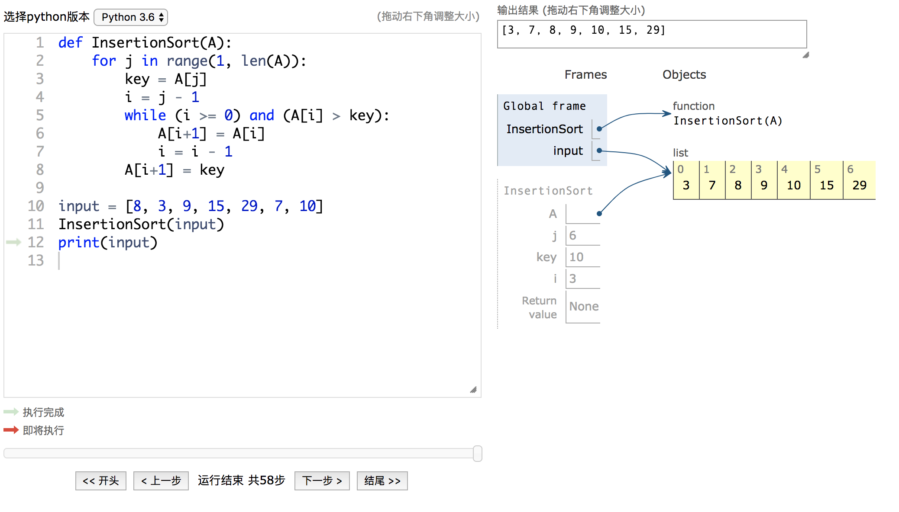

# Python Tutor Analyzation

<div align="center"></div>

抽离出Python Tutor(v5-unity)中的核心部分，包括：

1. 后端编译python代码返回json数据，代表了python每一步的运行状态
2. 前端根据json数据渲染出运行状态图，并支持单步调试

便于移植到其他项目中

`原项目：`

[Python Tutor Website](http://www.pythontutor.com/)

[Python Tutor v5 Github Repository](https://github.com/pgbovine/OnlinePythonTutor/tree/master/v5-unity)

## 使用方法：

### 准备工作

全局安装`pip3`(python3包管理器)以及`tsd`(typescript包管理器)

```shell
brew install pip3 # Mac下，其他系统自行上网搜索安装方法
npm install tsd -g
```

### 运行项目

```shell
git clone https://github.com/StarHyx/Python-Tutor-Analyzation.git
cd Python-Tutor-Analyzation
npm run preinstall # 安装所需依赖项
npm run server # 启动后端服务
```

打开`localhost:8003/debugger.html`，即可进行调试



`tests/example-code`中有一些可用的调试代码

### 本地重新构建

``` shell
npm run dev # 开发环境，打包速度较快，体积较大
npm run build # 生产环境，打包速度慢，体积小
```

## 项目结构

**入口 debugger.html**
**打包后文件（可以script标签直接引入）`dist/debugger.bundle.js`**

### 后端--server目录下

+ `bottle_server.py` ：后端入口
+ `LIVE_exec_py3.py` ：在live programming mode下处理请求
+ `pg_logger.py` 执行python代码的核心，会编译代码并返回json轨迹
+ `pg_encoder.py`：python语法分析
+ `generate_json_trace.py`：设置options.usercode值（需要编译的代码）即可编译出所需json轨迹,交给前端渲染

### 前端--src目录下

+ `lib` ：无法用npm管理的一些老旧的js库，未来将逐渐移除
+ `opt-live.ts`：前端入口
+ `visualize.ts`：渲染部门核心

## Todo

- [ ] lib中老旧库移除及替换
- [ ] opt-shared-session.ts移除（原为Python Tutor分享代码所需）
- [ ] css老旧库移除及替换，采用模块化管理（sass, less）
- [ ] 后端python代码精简优化，对外暴露compile方法，返回结果
- [ ] 后端服务单独部署
- [ ] 前端所有渲染工作集成为一个render函数，对外暴露，方便导出
- [ ] To be Continued…

## 更多建议：

Email: 450479592hyx@gmail.com

POPO: hanyixing@corp.netease.com